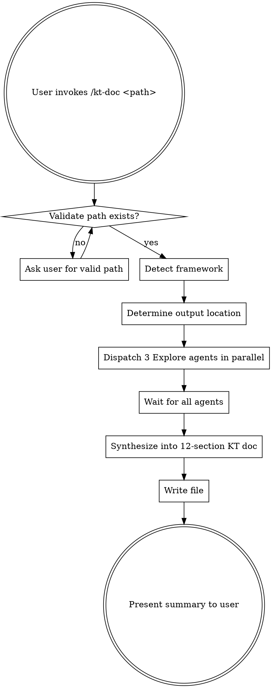

# KT Documentation Generator

Generate comprehensive, non-technical Knowledge Transfer documentation for any frontend module by deeply exploring its codebase.

## When to Use

- User wants to document a frontend module for handoff or onboarding
- Stakeholders need to understand what a feature does without reading code
- New developer joining a team needs module context
- Coding agent needs structured context about a module before making changes
- User says: "document this module", "create KT", "knowledge transfer", "onboarding doc", "what does this feature do"

## Audiences

The generated document serves three audiences simultaneously:

- **Product Owners / Stakeholders** — understand what the feature does, what business rules it enforces, what edge cases are handled, what metrics are tracked
- **New Developers** — understand user flows, data flow, API dependencies, cross-module interactions, and known limitations before touching the code
- **Coding Agents** — get structured context about module boundaries, dependencies, configuration, and state management to make informed changes

## The Process

---

## Step 1: Validate and Detect

### Validate the Module Path

1. Resolve the `<path>` argument relative to the current working directory
2. Confirm the directory exists and contains source files (`.js`, `.jsx`, `.ts`, `.tsx`, `.vue`, `.svelte`, `.astro`, `.html`)
3. If path is missing or invalid, ask the user: "Please provide a valid module path (e.g., `src/features/checkout`)"
4. Derive the **module name** from the last path segment (e.g., `src/features/checkout` → `checkout`)

### Detect the Framework

Scan the module directory and its ancestors for framework markers. Check in this order (first match wins):

| Signal                                                         | Framework          |
| -------------------------------------------------------------- | ------------------ |
| `next.config.*` or `app/layout.tsx` or `pages/_app.tsx`        | Next.js            |
| `nuxt.config.*` or `.nuxt/` directory                          | Nuxt               |
| `angular.json` or `*.component.ts` with `@Component` decorator | Angular            |
| `svelte.config.*` or `*.svelte` files                          | SvelteKit / Svelte |
| `remix.config.*` or `root.tsx` with `<Outlet/>`                | Remix              |
| `astro.config.*` or `*.astro` files                            | Astro              |
| `gatsby-config.*`                                              | Gatsby             |
| `*.vue` files                                                  | Vue                |
| `*.tsx` or `*.jsx` files with React imports                    | React              |
| `*.ts` or `*.js` files only                                    | Vanilla / Unknown  |

Also check `package.json` dependencies at the repo root for confirmation (`react`, `vue`, `@angular/core`, `svelte`).

If multiple frameworks are detected (micro-frontend), note all of them.

Store the result as `FRAMEWORK` — pass it to all 3 agents.

### Estimate Module Size

Count source files in the module directory (recursive). This calibrates agent exploration depth:

- **Small** (< 15 files): Agents should read all files
- **Medium** (15–50 files): Agents should read entry points, pages, and key files; scan others
- **Large** (50+ files): Agents should focus on entry points, route definitions, and public API; sample representative files from subdirectories

---

## Step 2: Determine Output Location

1. Find the repository root by walking up from the module path, looking for `.git/` or a root-level `package.json`
2. Check if a `docs/` directory exists at the repository root:
   - **If `docs/` exists** → write to `<repo-root>/docs/kt/<module-name>.md` (create `docs/kt/` if needed)
   - **If no `docs/`** → write to `<module-path>/KT.md`
3. If the output file already exists, ask the user: "A KT document already exists at `<path>`. Overwrite it?"

---

## Step 3: Dispatch 3 Explore Agents

Launch all 3 agents **in parallel** using the Agent tool with `subagent_type: "Explore"`. Each agent is read-only — they explore and report, they do not modify files.

Before dispatching, read the prompt template files and fill in the placeholders:

- `{MODULE_PATH}` → the resolved module path
- `{FRAMEWORK}` → the detected framework
- `{MODULE_SIZE}` → small / medium / large
- `{FILE_COUNT}` → number of source files

### Agent 1 — UI & Flows

Read `agent-ui-flows.md` from this skill's directory. Fill in placeholders. Dispatch with:

- **description**: `"Explore UI components and user flows in {MODULE_PATH}"`

This agent discovers: component hierarchy, routes, pages, navigation, user-facing text, forms, conditional rendering, user interactions, loading/empty/error states.

### Agent 2 — Data & APIs

Read `agent-data-apis.md` from this skill's directory. Fill in placeholders. Dispatch with:

- **description**: `"Explore data layer and API integrations in {MODULE_PATH}"`

This agent discovers: API calls, data fetching patterns, state management, type definitions, data transformations, auth patterns, external service integrations.

### Agent 3 — Cross-Cutting Concerns

Read `agent-cross-cutting.md` from this skill's directory. Fill in placeholders. Dispatch with:

- **description**: `"Explore cross-module dependencies and concerns in {MODULE_PATH}"`

This agent discovers: cross-module imports/exports, shared state, analytics events, feature flags, environment config, error boundaries, TODOs/FIXMEs, test coverage indicators, accessibility.

---

## Step 4: Synthesize into KT Document

Once all 3 agents return their structured reports, synthesize the findings into the 12-section KT document.

### Source Mapping

Use this table to know which agent's findings feed into which section:

| KT Section                        | Primary Source                       | Secondary Source                  |
| --------------------------------- | ------------------------------------ | --------------------------------- |
| 1. Module Overview                | All 3 agents (aggregate)             | Framework detection               |
| 2. User-Facing Functionality      | Agent 1                              | —                                 |
| 3. User Flows & Journeys          | Agent 1                              | Agent 2 (API calls in flows)      |
| 4. Business Rules & Logic         | Agent 1 (conditional rendering)      | Agent 2 (data validation)         |
| 5. Edge Cases & Error Handling    | Agent 1 (error/empty/loading states) | Agent 2 (API error handling)      |
| 6. API & Service Dependencies     | Agent 2                              | —                                 |
| 7. Cross-Module Interactions      | Agent 3                              | —                                 |
| 8. Data Flow                      | Agent 2 (state, transforms)          | Agent 3 (shared state)            |
| 9. Configuration & Feature Flags  | Agent 3                              | Agent 2 (env-dependent API calls) |
| 10. Key Metrics & Analytics       | Agent 3 (analytics events)           | Agent 1 (tracked interactions)    |
| 11. Known Limitations & Tech Debt | Agent 3 (TODOs/FIXMEs)               | All agents (concerns noted)       |
| 12. Glossary                      | All 3 agents (domain terms)          | —                                 |

### Writing Guidelines

The KT document serves product owners who have never read code, new developers who need context fast, and coding agents that need structured facts. The readers may be non-native English speakers across different countries. Writing must be simple, clear, and free of cognitive overload. These rules ensure the document is useful to everyone:

1. **Simple, plain English** — use short sentences with common, everyday words. Avoid idioms, jargon, fancy vocabulary, and complex grammar. If a simpler word exists, use it: "use" not "utilize", "start" not "initiate", "show" not "render", "get" not "retrieve", "check" not "validate". A non-native English speaker should read this without needing a dictionary.
2. **Non-technical language throughout** — explain what things DO, not how they are coded. No function names, no file paths, no code snippets in the output document. Translate code patterns into business/product language. A product owner reading "the `useOrderQuery` hook fetches from `/api/v2/orders`" gains nothing — they need "order data is loaded from the server when the page opens."
3. **Product-focused framing** — write as if explaining to a smart person who has never seen a line of code. "Users can filter their orders by date and status" not "The `OrderFilter` component renders a `DatePicker` and `StatusSelect`."
4. **"When X, then Y" format for business rules** — this format makes rules easy to scan and test. e.g., "When a user is on the free plan, the export button is not available."
5. **Step-by-step for user flows** — numbered steps showing entry point → actions → outcome. This is how QA teams and product owners think about features.
6. **Sections with no findings** — include the section with a note: "No [X] were detected in this module." Do NOT omit sections. This tells readers the area was checked, not overlooked.
7. **Consistent voice** — third person, present tense, short declarative sentences. One idea per sentence. Aim for 10–20 words per sentence.

### Using the Template

Read `kt-template.md` from this skill's directory. It contains the exact structure and per-section writing guidance. Follow the template structure exactly when writing the output document.

---

## Step 5: Write and Present

1. Write the synthesized KT document to the determined output path
2. Present a brief summary to the user:
   - Where the file was written
   - What framework was detected
   - Quick stats: number of components documented, user flows identified, API endpoints cataloged, business rules extracted, analytics events found, tech debt items flagged
   - Which sections had no findings (these are areas worth noting — they may indicate gaps in the feature)
   - A 2-3 sentence overview of what the module does (from Section 1)

---

## Edge Cases

### Monorepo Structure

If the module is part of a monorepo (multiple `package.json` files at different levels), use the nearest `package.json` ancestor for framework detection. Place output relative to the monorepo root.

### Very Large Modules (100+ files)

Agents should focus on entry points and page-level components rather than exhaustively reading every file. The synthesis step should note: "This is a large module. This document covers the primary flows and may not capture every sub-feature."

### No API Calls Found

Section 6 (API & Service Dependencies) should say: "This module does not make direct API calls. It may receive data through props or shared state from parent modules." Check Agent 3's cross-module findings for indirect data sources.

### Multi-Framework Module

If multiple frameworks are detected, note all of them in the Module Overview and instruct agents to scan for patterns from all detected frameworks.

### Module with No Clear Entry Point

If no routes, pages, or obvious entry components are found, Agent 1 should report the file with the most imports from within the module as the likely entry point. Note this in the Module Overview.

### Server Components (Next.js App Router)

If files contain `'use client'` or `'use server'` directives, Agent 1 should note which components run server-side vs client-side. This is architecturally significant and should be mentioned in the Module Overview.

---

## Common Mistakes

| Mistake                                              | Fix                                                                                                  |
| ---------------------------------------------------- | ---------------------------------------------------------------------------------------------------- |
| Writing technical documentation with code references | Remove all function names, file paths, code snippets. Translate to business language.                |
| Skipping sections with no findings                   | Always include every section. Write "No [X] detected" so readers know it was checked.                |
| Making the document too long                         | Each section should be concise. Bullet points over paragraphs. Cover key paths, not every edge case. |
| Writing from the developer's perspective             | Write from the user's perspective. "Users can..." not "The component renders..."                     |
| Guessing at business context not in the code         | Only document what the code reveals. Don't invent business justifications.                           |
